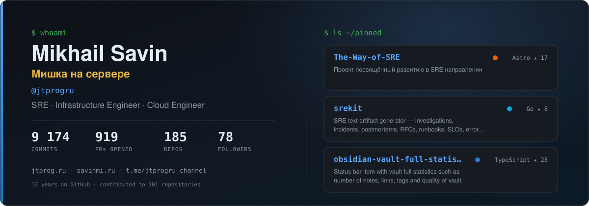
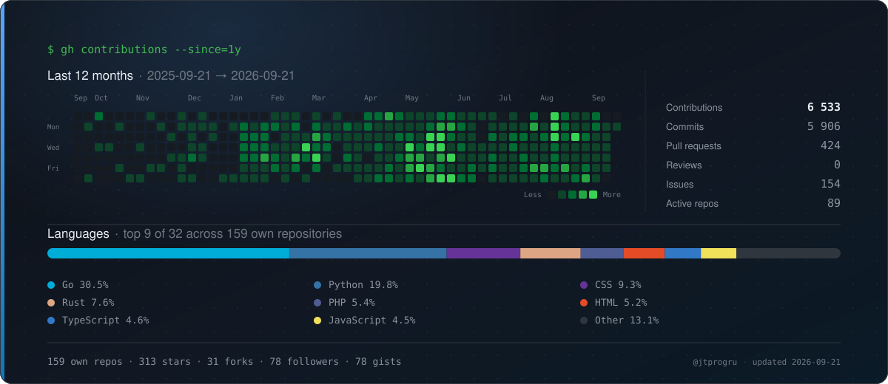

# Hi! My name is Mikhail - aka [@jtprogru][mygh] 👋

[][keybase]
[][tg_chat]
[][tg_channel]

I'm a Lead SRE and Head of Reliability at [h3llo.cloud][h3llo], building the SRE function of a young public cloud from scratch: observability architecture, on-call policy, service ownership matrix. In operations since 2014, in IT since 2003. Before that — Avito, Positive Technologies, VK, Yandex.Bank.

## Here are a few facts about me

* ☕️ I try to automate things that need to be done more than three times;
* 💻 I write in Go and Python, and rewrite some of my CLI tools in Rust;
* ☸️ Daily stack: Kubernetes, KubeVirt, Linstor, Kube-OVN, Terraform, Ansible, Prometheus, Grafana;
* 🎤 Program committee member at [DevOpsConf][devopsconf];
* 📚 I maintain [The Way of SRE][waysre] — an open collection of materials for everyone growing into SRE;
* 🧑‍🏫 I mentor via [GetMentor][getmentor] and occasionally teach at RTU MIREA;
* 🍻 I collect beer mat and caps from beer bottles, but I don't drink at the same time;
* 📷 I shoot mobile photography — [Unsplash][unsplash] and [Michael behind lens][tg_lens];
* 📋 My actual CV is available [here][myrucv] in Russian;
* 🦄 Always ready to learn new things and share knowledge.

## Pet projects

* [The Way of SRE][waysre] — notes and materials for those developing in the SRE direction;
* [srekit][srekit] — generator of text SRE artifacts: postmortems, RFCs, runbooks, changelogs;
* [notiflow][notiflow] — GitHub Action for sending notifications to Telegram;
* [indexnow][indexnow] — CLI and composite GitHub Action to notify IndexNow (Bing, Yandex) about changed pages;
* [hostsctl][hostsctl] — `/etc/hosts` management from a YAML config: groups, zone files, remote blocklists.

## Contact

Write me in Telegram — [@jtprogru][tg_me] — about work, consulting, or anything around SRE, reliability, incident management and on-call. For a call, book a slot in [my calendar][calendar].

## My WWW

* CV (RU) - [savinmi.ru][myrucv]
* Blog (RU) - [jtprog.ru][myblog]
* Telegram channel (RU) - [Мишка на сервере][tg_channel]
* Publications (RU) - [Habr][habr]

---

[myrucv]: https://savinmi.ru
[myblog]: https://jtprog.ru
[mygh]: https://github.com/jtprogru
[tg_chat]: https://ttttt.me/jtprogru_chat
[tg_channel]: https://ttttt.me/jtprogru_channel
[tg_me]: https://t.me/jtprogru
[tg_lens]: https://t.me/michael_behind_lens
[keybase]: https://keybase.io/jtprog
[h3llo]: https://h3llo.cloud
[devopsconf]: https://devopsconf.io/
[waysre]: https://jtprogru.github.io/The-Way-of-SRE/
[getmentor]: https://getmentor.dev/mentor/jtprogru
[calendar]: https://calendlab.ru/c/jtprogru-getmentor
[habr]: https://habr.com/ru/users/jtprogru/
[unsplash]: https://unsplash.com/@jtprogru
[srekit]: https://github.com/jtprogru/srekit
[notiflow]: https://github.com/jtprogru/notiflow
[indexnow]: https://github.com/jtprogru/indexnow
[hostsctl]: https://github.com/jtprogru/hostsctl
